# How to Copy This Jeopardy Game

Welcome to the **Copy This Jeopardy Game Guide**! If you’re looking to create your own version of this Jeopardy game, you’re in the right place. This guide will take you through the entire process, step by step, starting from creating an account on GitHub all the way to modifying your game and publishing it online.

Don’t worry if you’re not super technical—each step is broken down clearly for you.

---

## Video Guides

Step 1 (Click to Play) [LINK](https://www.youtube.com/watch?v=i2q2joe7zmg)

[](https://www.youtube.com/watch?v=i2q2joe7zmg)

Step 2 (Click to Play) [LINK](https://www.youtube.com/watch?v=-D1Etj4JJ0M)

[](https://www.youtube.com/watch?v=-D1Etj4JJ0M)

---

## Step 1: Create a GitHub Account

If you don’t have a GitHub account yet, let’s start there.

1. **Go to [GitHub.com](https://github.com/)**.
2. Click the **Sign up** button in the upper-right corner.
3. Fill out the required information to create your account: username, email, and password.
4. Complete any security verification.
5. Once your account is created, log in to GitHub.

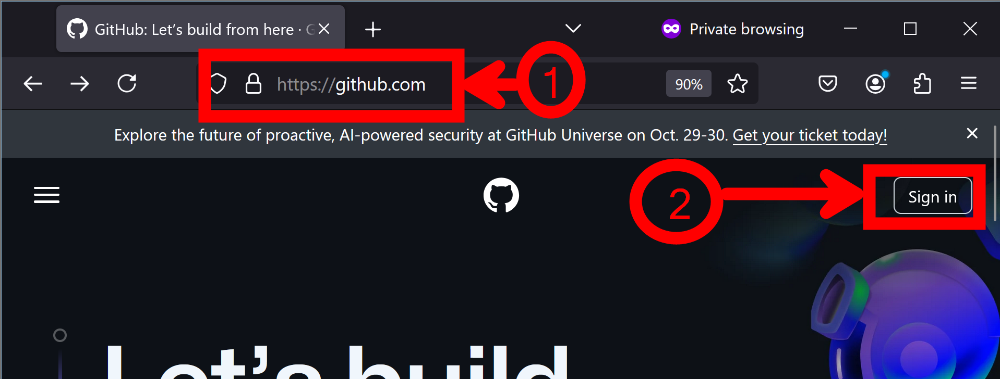

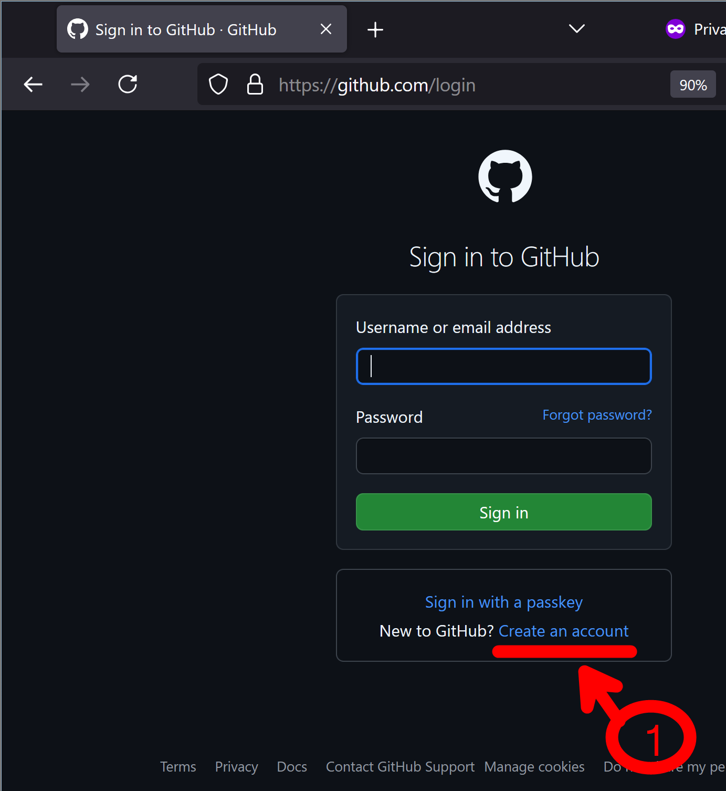

---

## Step 2: Fork the Repository

Now, you’ll make a copy of the Jeopardy game code so you can customize it.

1. Go to the repository that hosts the Jeopardy game https://github.com/miamimanni/jeopardy2
2. Once you’re on the main page of the repository, look for the **Fork** button in the upper-right corner (it’s near the Star and Watch buttons).
3. Click **Fork** to create a copy of the repository in your GitHub account.
4. After a few moments, you’ll see a new copy of the repository under **your** account. This is now **your** version to edit and modify as you like!

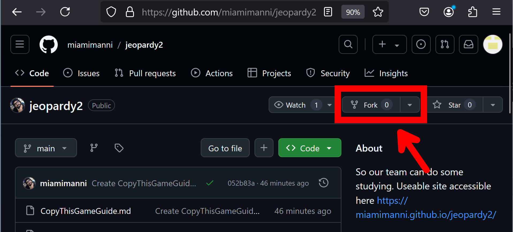

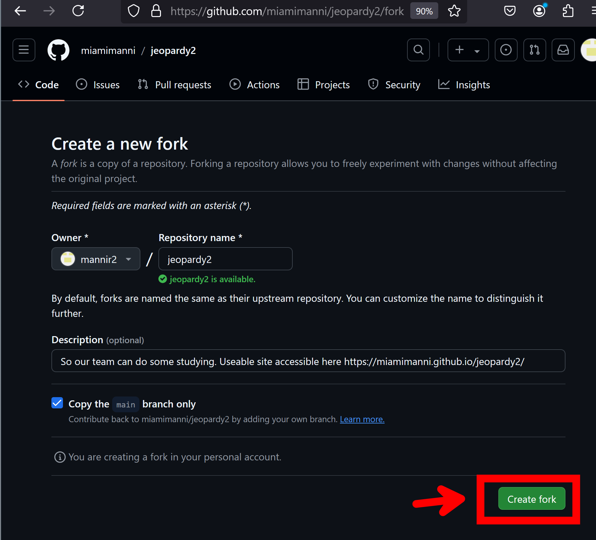

---

## Step 3: Enable GitHub Pages

You’re going to publish your version of the game to GitHub Pages, which is a free service that hosts your website.

1. On your newly forked repository, click the **Settings** tab.
2. Scroll down to the **GitHub Pages** section.
3. In the dropdown under **Source**, select **main branch**.
4. Once selected, GitHub Pages will automatically publish your website from the `index.html` file in the repository.
5. You’ll get a green notification saying your site is published! The link to your live website will appear here—save this link for later!

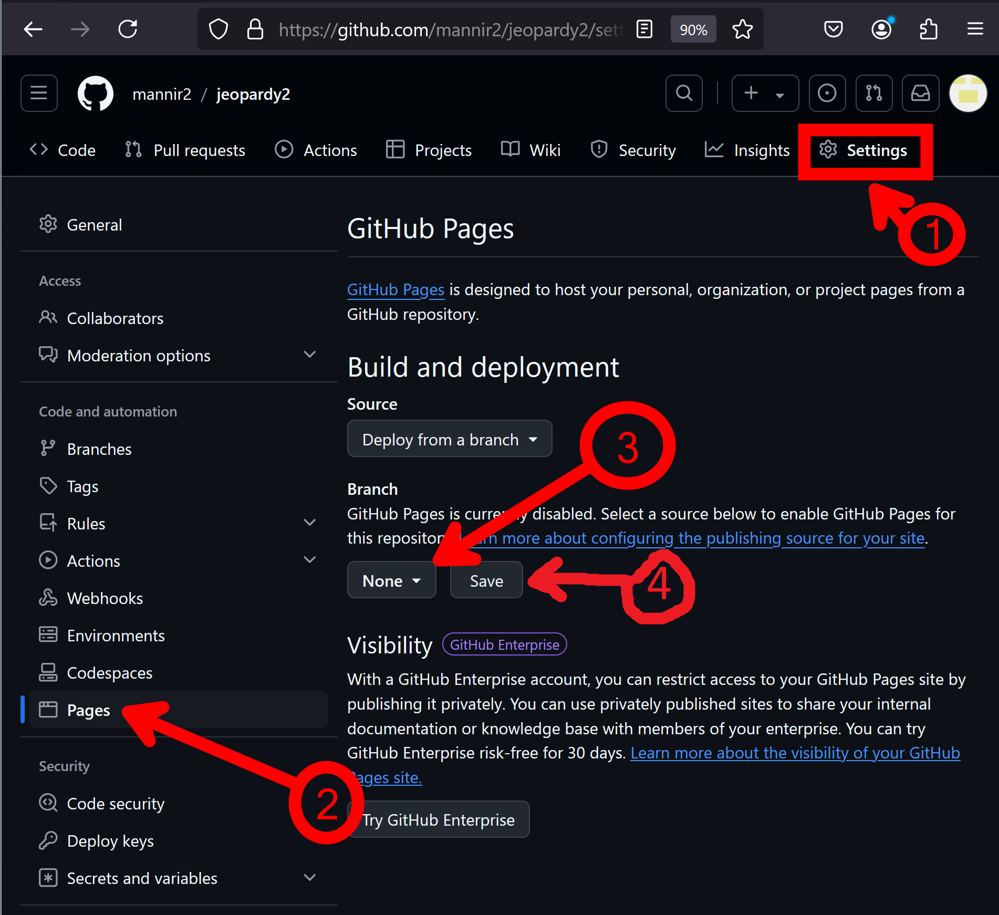

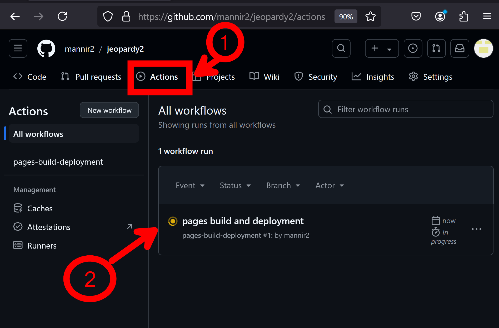

---

## Step 4: Create a GitHub CodeSpace

GitHub CodeSpaces gives you an environment to edit your code directly within your browser.

1. Go to your repository on GitHub.
2. Click the **Code** button (the green one), and choose **CodeSpaces**.
3. Click **Create CodeSpace**. This will open a development environment in your browser.
4. Inside CodeSpace, you’ll see the files of your repository on the left and the code editor in the center.

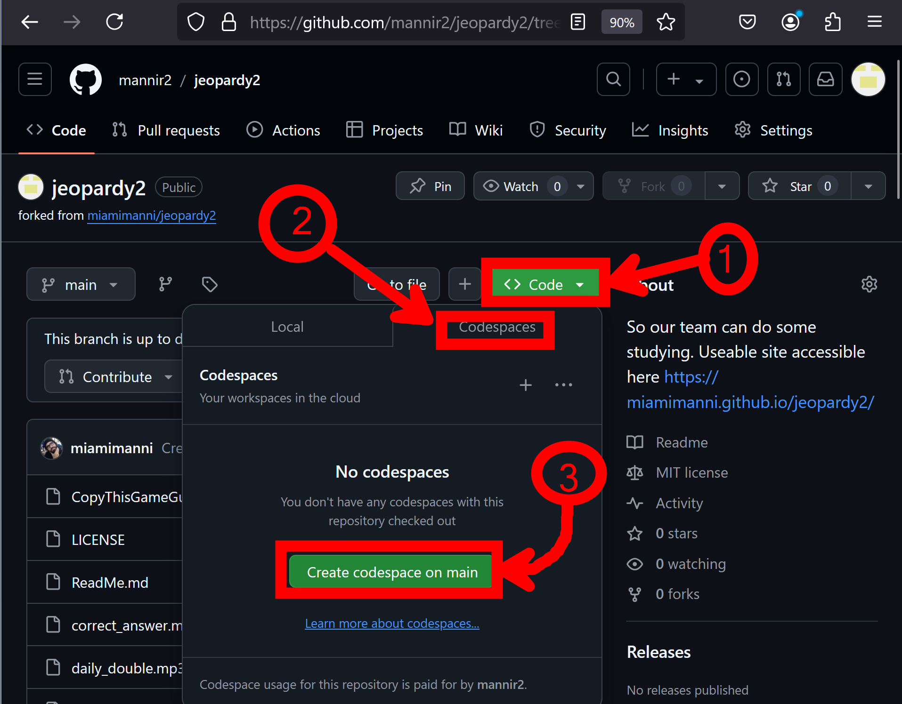

### Recommended Extensions

While you’re in CodeSpace, installing these extensions will make your work easier:
- **Prettier - Code Formatter**: Helps format your code.

To install these extensions:
1. Click the **Extensions** icon on the left sidebar in CodeSpace.
2. Search for the extensions by name and click **Install**.

---

## Step 5: Modify the Game Data

Now that you’re in the code, let’s modify the game itself!

1. In the file list on the left, find and click on the `script.js` file. This file contains the main logic for the game.
2. Look for this section of code inside the `script.js` file:

```javascript
const gameData = {
    "Board Name": {
        "single": [
            {
                "category": "Category 1",
                "clues": [
                    {
                        "value": 200,
                        "clue": "This is a sample clue.",
                        "solution": "What is the sample solution?"
                    },
                    // ... more clues
                ]
            },
            // ... more categories
        ],
        "double": [
            // ... Similar structure as "single" with different values
        ],
        "final": {
            "category": "Final Category",
            "clue": "This is the Final Jeopardy clue.",
            "solution": "What is the solution to the Final Jeopardy clue?"
        }
    },
    // ... more boards
};
```


3. To customize the game, change the `"category"`, `"clue"`, `"solution"`, and `"value"` fields as you wish! For example:
   - Change `"Category 1"` to something else like `"Science"`.
   - Modify the clue to be a question of your choice.
   - Update the solution with the correct answer.
4. You can add or remove categories and clues by following the same structure you see in the example.

Note you can use this [sample game](https://github.com/miamimanni/jeopardy2/blob/main/sample_game.json) as a guide

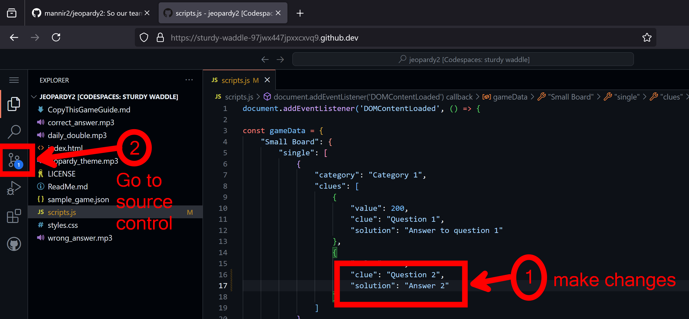

---

## Step 6: Save Your Changes and Commit

Once you’ve made the changes to your game, you need to save and push them to GitHub.

1. In CodeSpace, click **File** > **Save** to save the changes you’ve made to the `script.js` file.
2. Now, let’s commit your changes:
   1. On the left sidebar, click the **Source Control** icon (it looks like a branch).
   2. You should see your modified `script.js` file listed. Click the **+** button next to the file to stage it.
   3. In the text box above, write a short message about your changes, like `Updated game data`.
   4. Click the checkmark icon to commit the changes.

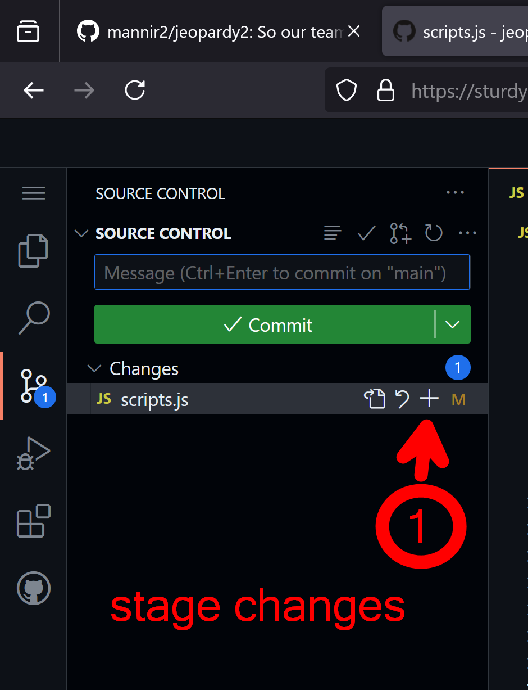

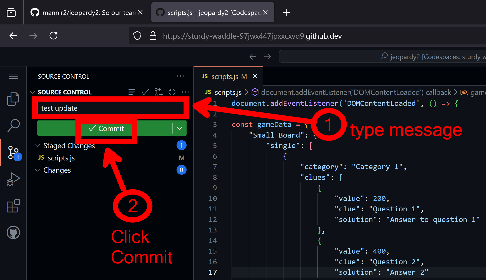

---

## Step 7: Push Your Changes to GitHub

Now that you’ve committed your changes, you need to push them to GitHub.

1. Press button Sync Changes

This command sends your changes to the GitHub repository. Once the command is complete, your code is live on your repository!

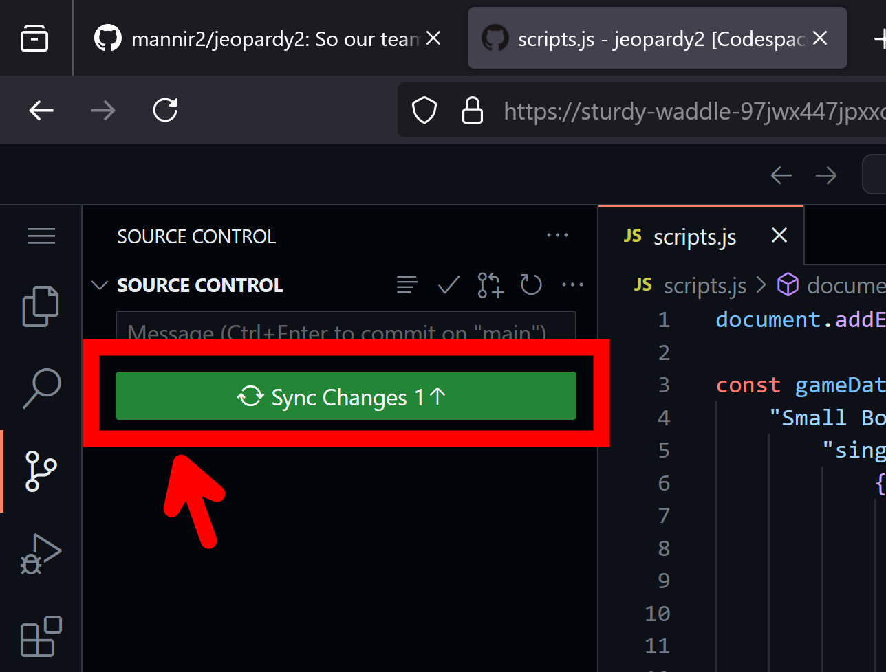

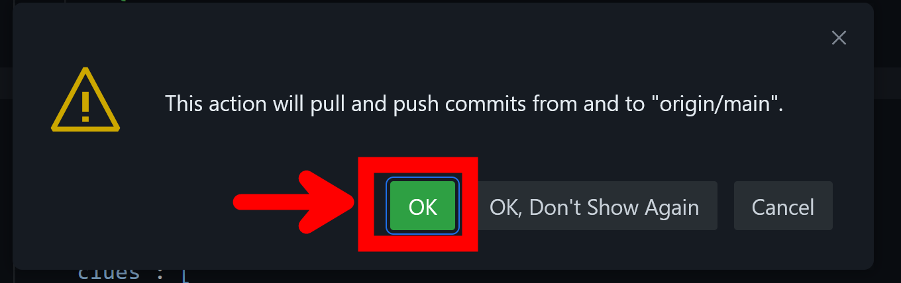


---

## Step 8: Check GitHub Actions

GitHub will automatically build your changes and publish them on your GitHub Pages site.

1. Go back to your repository on GitHub.
2. Click the **Actions** tab at the top.
3. Here, you’ll see the progress of your website being rebuilt.
4. Once the process completes, your new game will be live! Use the GitHub Pages link from Step 3 to see your changes online.


---

## Conclusion

Congratulations! 🎉 You’ve successfully copied the Jeopardy game, made your own changes, and published it live! Feel free to modify it more, update categories, or change clues and solutions.

If you run into any issues, check out GitHub’s documentation or feel free to reach out for help!

---

This guide provides detailed steps for beginners, ensuring they can copy and modify your Jeopardy game with confidence. Let me know if you'd like any tweaks!
